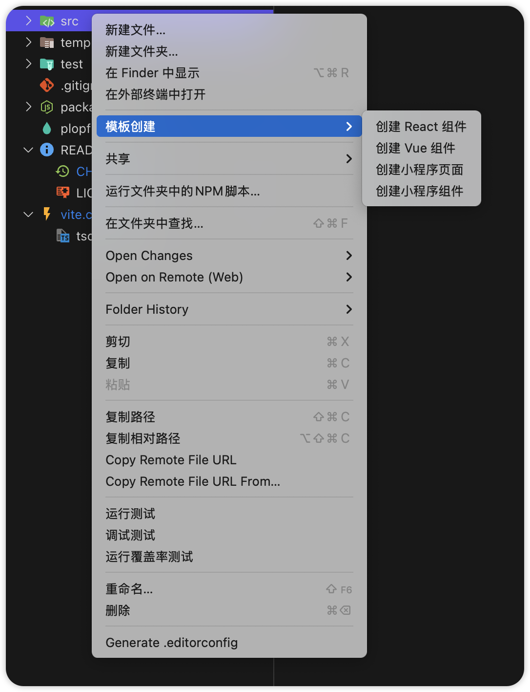

# fast-template

通过vscode插件快速创建react、vue、微信小程序组件和微信小程序页面



## 特性

- 支持快速创建 React/Vue 组件
- 支持快速创建微信小程序页面
- 支持快速创建微信小程序组件
- 支持 ts/js
- 支持vue组件的 composition/options 类型
- 支持wxml文件的Emmet语法（输入view后按Tab键自动展开为`<view></view>`）

## 快速开始

### 前置要求

- Node.js 22+
- pnpm 10.8.0+
- VSCode 1.90.0+

```bash
# 克隆仓库
git clone https://github.com/chief-fei/fast-template.git

# 进入项目目录
cd fast-template

# 安装依赖
pnpm install
```

### 开发

```bash
# 启动开发模式
pnpm run dev

# 构建扩展
pnpm run build

# 打包扩展
vsce package
```

## 功能说明

### wxml的Emmet支持

- 在wxml文件中支持Emmet语法
- 输入标签名后按Tab键可以自动展开为完整标签
- 例如：输入`view`后按Tab键，会自动展开为`<view></view>`
- 支持所有小程序原生标签的Emmet展开

### 组件创建

- 支持快速创建 React 组件
- 支持快速创建 Vue 组件
- 提供默认组件模板
- 支持自定义组件模板

### 开发工具链

- Vite 构建工具
- TypeScript 支持
- ESLint + Prettier 代码规范
- Husky + lint-staged Git 提交检查
- VS Code 测试框架

## 配置说明

### Vite 配置

项目使用 Vite 作为构建工具，配置文件位于 `vite.config.ts`。主要配置包括：

- 输出目录设置
- 构建优化
- 开发服务器配置

### ESLint 配置

代码规范检查使用 ESLint，配置文件位于 `eslint.config.mjs`。

## 发布扩展

1. 更新 `package.json` 中的版本号
2. 运行 `pnpm run package` 构建扩展
3. 使用 VSCode 扩展发布工具发布

## 贡献指南

1. Fork 本仓库
2. 创建特性分支 (`git checkout -b feature/AmazingFeature`)
3. 提交更改 (`git commit -m 'Add some AmazingFeature'`)
4. 推送到分支 (`git push origin feature/AmazingFeature`)
5. 开启 Pull Request

## 许可证

本项目采用 MIT 许可证 - 查看 [LICENSE](LICENSE) 文件了解详情
